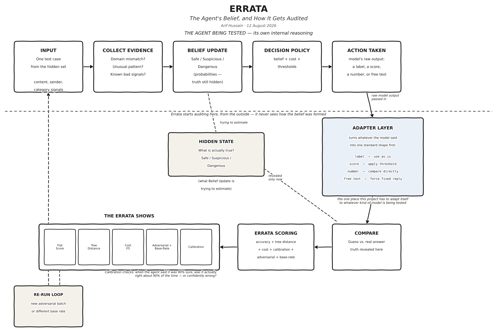

# Errata

**An evaluation harness that audits AI classifiers and agents — catching the mistakes a plain accuracy score hides.**

Most AI projects end with one number: *"my model is 94% accurate."* That number sounds like an answer, but it rarely tells you the thing you actually need to know — accurate at what, and what happens on the 6% it gets wrong?

Errata is not another classifier. It's the tool that sits on top of any classifier or agent and checks whether its score can actually be trusted. Hand it a model and a test set, and instead of one number, it hands back an itemised record: which specific mistakes the model made, how far off each one was, what it would actually cost, whether the model's confidence can be trusted, and whether it can be tricked.

Think of it less like a student taking an exam, and more like the person standing at the door afterward, checking whether the exam actually proved anything.

## Why "Errata"?

An errata is the corrected record a publisher attaches to a book after it's already printed — not a star rating, but an itemised list of exactly what's wrong and where. This project does the same thing for a model's predictions: instead of one clean verdict, it hands back the itemised correction record. See [`docs/research-notes.md`](docs/research-notes.md) for the full reasoning, including the honest caveat on where that metaphor doesn't perfectly apply.

## How it works



The short version:

1. Start with a test set where the right answers are already known — but keep them hidden from the model while it makes its guesses.
2. Let the model predict, blind. Whatever it hands back (a label, a score, a number, or free text) gets standardised by a small adapter layer before anything else touches it.
3. Only after every guess is locked in, reveal the real answers and compare.
4. Score the result several different ways at once: a plain flat accuracy score, how far off the guess was on the category tree, what it would cost in rupees, and whether the model's stated confidence matched how often it was actually right.
5. Mix in a handful of deliberately adversarial test cases, and separately re-run the whole thing while dialling the rare-case rate up or down.
6. Put it all together into one report — not one number pretending to speak for everything.

Full step-by-step pseudocode for all of this is in [`docs/pseudocode.md`](docs/pseudocode.md).

## What's actually new here

Two pieces of this don't exist anywhere as a ready-to-use tool, as far as the research in this repo could find:

- **Tree-distance scoring** — treating "mistook phishing for malware" as a smaller error than "mistook phishing for safe." The underlying idea is published research (Apple's *Neo*, CHI 2022), but no open, installable implementation of it exists — this repo builds it from scratch.
- **Cost + hierarchy + calibration combined in one report** — most tools do one of these in isolation. Combining "how severe," "how expensive," and "was the confidence honest" into a single evaluation is the actual contribution here.

Full literature review and gap analysis: [`docs/research-notes.md`](docs/research-notes.md).

## Project status

This repo currently holds the research, design, and pseudocode produced before writing any real code. The `src/errata/` folder is the intended home for the actual implementation as it gets built.

| Piece | Status |
|---|---|
| Problem research & prior-art check | Done — see `docs/research-notes.md` |
| Tools & architecture decisions | Done — see `docs/tools-and-approach.md` |
| Full pseudocode (9 steps) | Done — see `docs/pseudocode.md` |
| Flow diagram | Done — see `assets/errata-flow-diagram.png` |
| Social Media Discussion | Ongoing — `https://www.reddit.com/r/learnmachinelearning/s/3QpeJ4lR3p'
                                        `https://www.reddit.com/r/AI_Agents/s/d5597YtN3n'
| Dry run proving the scoring logic works | Done — see `docs/dry-run-walkthrough.md` |
| Actual Python implementation | Not started |

## Repo structure

```
errata/
├── README.md                     ← you are here
├── LICENSE
├── requirements.txt
├── .gitignore
├── .env.example
├── docs/
│   ├── research-notes.md         ← the "why" behind this project
│   ├── tools-and-approach.md     ← tools, decisions, and reasoning
│   └── pseudocode.md             ← step-by-step logic, all 9 steps
├── assets/
│   └── errata-flow-diagram.png
├── src/
│   └── errata/                   ← the actual implementation goes here
└── tests/                        ← tests for the scoring logic
```

## Getting started (once code lands)

```bash
git clone https://github.com/<your-username>/errata.git
cd errata
python -m venv .venv
source .venv/bin/activate      # on Windows: .venv\Scripts\activate
pip install -r requirements.txt
```

Copy `.env.example` to `.env` and fill in any local settings (e.g. your LiteLLM/Ollama endpoint) before running anything that needs a model.

## License

MIT — see [`LICENSE`](LICENSE).

---

Built by Arif Hussain as a personal project to demonstrate evaluation rigor for AI systems — not just building a model, but proving whether one is actually safe to trust.
